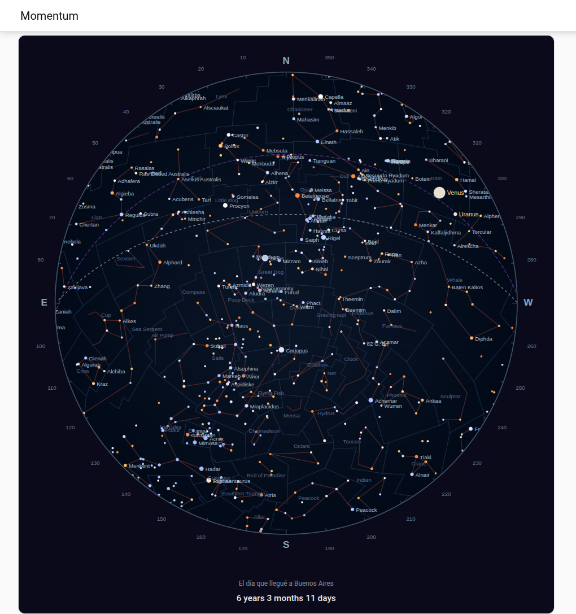

# Momentum

[](https://github.com/hacs/integration)
[](https://www.home-assistant.io)
[](LICENSE)

A [HACS](https://hacs.xyz) integration for Home Assistant that preserves a meaningful moment — a birth, a wedding, a milestone — by capturing the exact sky above you that night and displaying it on your dashboard with a living elapsed-time counter.



## How it works

1. During setup you provide the date, time, and coordinates of your moment
2. Momentum fetches the sky map once from the [Celeste](https://api.celeste.crubio.fyi) API and stores it locally
3. A sensor updates daily with the elapsed time: `6 years 3 months 10 days`
4. A custom Lovelace card displays the sky map and the counter

## Installation

1. Add this repo as a custom repository in HACS
2. Install **Momentum** and restart Home Assistant
3. Go to **Settings → Devices & Services → Add Integration → Momentum**

## Setup

The config flow asks for:

| Field | Example |
|---|---|
| Name | El día que nació Lucía |
| Date | 2020-03-15 |
| Time (UTC) | 22:30 |
| Latitude | -34.6037 |
| Longitude | -58.3816 |

## Lovelace card

```yaml
type: custom:momentum-card
entity: sensor.<your_moment>_elapsed_time
```

## Requirements

- Home Assistant 2024.1 or later
- HACS 2.x or later
